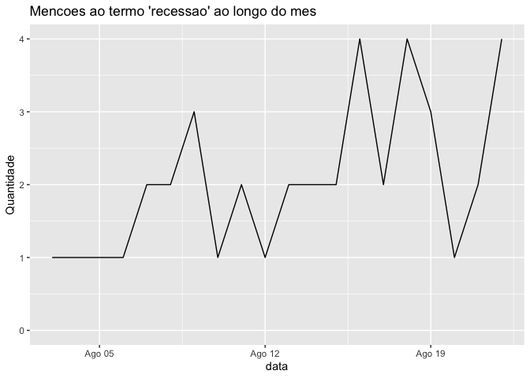

<!-- README.md is generated from README.Rmd. Please edit that file -->

[](https://travis-ci.org/tomasbarcellos/folhar2)
[](https://www.tidyverse.org/lifecycle/#experimental)

# folhar2

O objetivo de folhar2 eh fazer raspar dados da Folha.

## Installation

Para instalar do github, rode

``` r
remotes::install_github("tomasbarcellos/folhar2")
```

## Exemplo

This is a basic example which shows you how to solve a common problem:

``` r
library(folhar2)

inicio_mes <- Sys.Date() %>% 
  lubridate::floor_date("month") %>% 
  format(format = "%d/%m/%Y") 

busca <- folha_buscar("recessao", inicio_mes)
busca
#> # A tibble: 40 x 5
#>    secao     manchete            resumo            hora    link            
#>    <chr>     <chr>               <chr>             <chr>   <chr>           
#>  1 Folha de… Governo calcula al… Se esse resultad… 22.ago… https://www1.fo…
#>  2 Folha de… Dólar vai a R$ 4,0… O rendimento mai… 22.ago… https://www1.fo…
#>  3 Folha de… Dinâmica da desigu… Mas, com a chega… 22.ago… https://www1.fo…
#>  4 Folha de… Aposta habitacional São bem-vindas, … 22.ago… https://www1.fo…
#>  5 Folha de… Ataque ao BNDES é … Mas não pode, e … 21.ago… https://www1.fo…
#>  6 Folha de… Banco público quer… Com a mudança, a… 21.ago… https://www1.fo…
#>  7 Folha de… Caixa lança crédit… Com a mudança, a… 20.ago… https://www1.fo…
#>  8 Folha de… Dólar sobe 1,6% e … Nesta segunda-fe… 19.ago… https://www1.fo…
#>  9 Folha de… Economistas melhor… Não estou vendo … 19.ago… https://www1.fo…
#> 10 Folha de… Não dar seguro saú… E a reforma bras… 19.ago… https://www1.fo…
#> # … with 30 more rows
```

Quais as sesoes da folha que mais publicaram sobre recessao?

``` r
table(busca$secao)
#> 
#> Folha de S.Paulo - Educação  Folha de S.Paulo - Mercado 
#>                           1                          28 
#>    Folha de S.Paulo - Mundo  Folha de S.Paulo - Opinião 
#>                           5                           5 
#>    Folha de S.Paulo - Poder 
#>                           1
```

Evolucao do uso do termo no mes

``` r
library(ggplot2)
library(dplyr)

busca %>% 
  select(hora) %>% 
  mutate(hora = stringr::str_remove(hora, "º"),
         data = stringr::str_extract(hora, "\\d{1,2}\\.[a-z]{3}\\.\\d{4}"),
         data = as.Date(data, format = "%d.%b.%Y")) %>% 
  count(data) %>% 
  ggplot(aes(data, n)) +
  geom_line() +
  scale_y_continuous("Quantidade", limits = c(0, NA)) + 
  ggtitle("Mencoes ao termo 'recessao' ao longo do mes")
```


